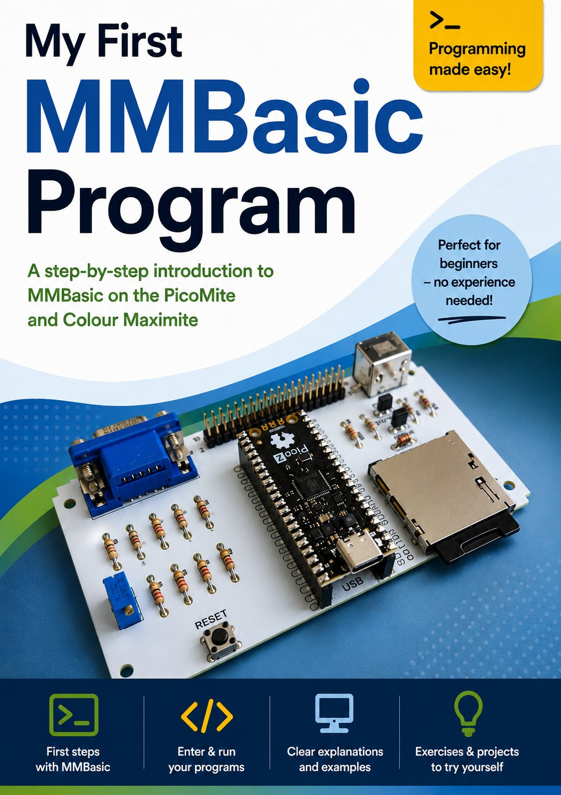
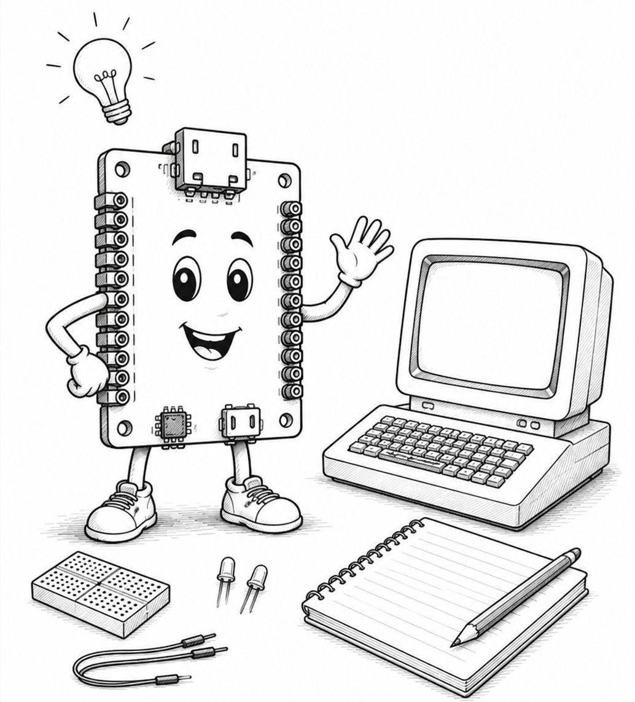

= My first MMBasic Program
Manfred Becker
:doctype: book
:notitle:
:toc: macro
:toclevels: 1
:sectnums:
:icons: font
:revnumber: 0.1
:revdate: 2026-08-02
:github-programme: https://github.com/ManiBecker/MyFirstMMBasicProgram/blob/main/programs

<<<

[.text-center]
= My first MMBasic Program

[.text-center]
*Step by Step into the World of MMBasic*

[.text-center]
for PicoMite and Colour Maximite

[.text-center]
Manfred Becker

[.text-center]
Version {revnumber} +
{revdate}

<<<

[colophon]
== Legal Notice

Author: Manfred Becker

Project page: +
https://github.com/ManiBecker/MyFirstMMBasicProgramm

This tutorial is being developed step by step and is publicly available on GitHub.

I would like to extend my special thanks to Geoff Graham, the developer of MMBasic, as well as
Peter Mather, who played a pivotal role in further developing MMBasic
for the Colour Maximite 2 and the PicoMite family.

Without their years of work and the freely available manuals, this
tutorial would not be possible.

**Note on the Creation of the Tutorial**

This tutorial was created by the author and is continuously being updated.

Tools based on generative artificial intelligence (AI) were used to assist with drafting the text, revising the language, and structuring individual chapters.

All technical content, program examples, and technical statements were selected, reviewed, and approved for publication by the author.

**Note on the Illustrations**

Many of the illustrations in this tutorial were created with the assistance of generative artificial intelligence (AI).

<<<

toc::[]

<<<

include::chapter/00-welcome.adoc[]

= Part I – Getting Started

include::chapter/01-hello-world.adoc[]

= Part II – Building Larger Programs

= Part III – Graphics and Games

= Part IV – Hardware

= Part V – Development Tools

= Part VI – Files and Projects

= Part VII – Advanced Topics

= Epilogue

= Appendix

<<<

